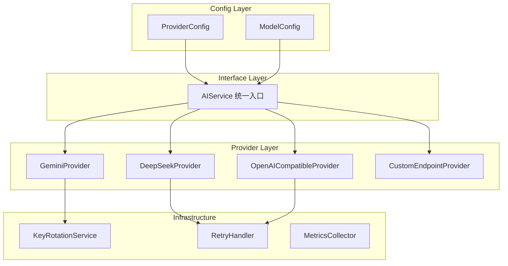

# AI 多端点服务重构方案

## 一、现状分析

### 1.1 当前架构

```
src/chat/
├── config/
│   └── chat_config.py          # 包含 CUSTOM_GEMINI_ENDPOINTS 配置
├── services/
│   ├── gemini_service.py       # 核心AI服务（70KB，约1724行）
│   ├── key_rotation_service.py # API密钥轮换服务
│   └── ...
└── features/chat_settings/
    └── services/chat_settings_service.py  # 模型选择服务
```

### 1.2 GeminiService 代码结构分析

[`gemini_service.py`](src/chat/services/gemini_service.py) 包含 1724 行代码，职责分布如下：

| 方法名 | 行数范围 | 职责 | 依赖 |
|--------|---------|------|------|
| `__init__` | 255-317 | 初始化服务、加载工具 | key_rotation_service, ToolService |
| `_api_key_handler` | 69-241 | 密钥轮换装饰器 | key_rotation_service |
| `_create_client_with_key` | 328-339 | 创建 Gemini 客户端 | google.genai |
| `generate_response` | 511-694 | **主入口分发器** | 所有下游方法 |
| `_generate_with_custom_endpoint` | 696-795 | 自定义端点生成 | _execute_generation_cycle |
| `_generate_with_official_api` | 797-849 | 官方API生成 | _execute_generation_cycle |
| `_execute_generation_cycle` | 851-1256 | **核心生成周期**（工具调用循环） | prompt_service, ToolService |
| `generate_embedding` | 1258-1294 | RAG 向量生成 | google.genai |
| `generate_text` | 1296-1338 | 简单文本生成 | google.genai |
| `generate_simple_response` | 1340-1409 | 单次生成（礼物等） | 自定义端点 |
| `generate_thread_praise` | 1411-1534 | 暖贴功能 | 自定义端点 |
| `generate_text_with_image` | 1545-1622 | 投喂功能（图文） | 自定义端点 |
| `generate_confession_response` | 1624-1671 | 忏悔功能 | 自定义端点 |
| `_record_token_usage` | 1673-1720 | Token 统计 | token_usage_service |

### 1.3 当前支持的端点

| 端点类型 | 实现方式 | 配置位置 |
|---------|---------|---------|
| Gemini 官方 API | `google.genai` SDK + 密钥轮换 | `GOOGLE_API_KEYS_LIST` |
| 自定义 Gemini 端点 | `CUSTOM_GEMINI_ENDPOINTS` 字典 | `chat_config.py` |

### 1.4 当前问题

1. **代码耦合严重**: `gemini_service.py` 承担了过多职责
   - 主对话生成
   - 多种特殊功能（暖贴、投喂、忏悔）
   - 密钥轮换
   - Token 统计
   - 工具调用管理

2. **扩展困难**: 添加新端点需要修改多处代码
3. **配置分散**: 模型配置分布在 `chat_config.py` 和 `src/config.py` 两处
4. **缺乏抽象**: 没有统一的 AI Provider 接口

---

## 二、目标架构

### 2.1 设计原则

- **Provider 模式**: 统一的 AI 服务接口，支持多种后端
- **配置驱动**: 通过配置文件定义端点，无需修改代码
- **单一职责**: 每个类/模块只负责一件事
- **优雅降级**: 自动故障转移和重试机制

### 2.2 新架构图



---

## 三、详细设计

### 3.1 目录结构

```
src/chat/services/
├── ai/
│   ├── __init__.py
│   ├── service.py              # AIService 统一入口
│   ├── providers/
│   │   ├── __init__.py
│   │   ├── base.py             # BaseProvider 抽象基类
│   │   ├── gemini_provider.py  # Gemini 官方 API
│   │   ├── deepseek_provider.py# DeepSeek API
│   │   ├── openai_provider.py  # OpenAI 兼容端点
│   │   └── custom_provider.py  # 自定义端点（通用）
│   ├── config/
│   │   ├── __init__.py
│   │   ├── providers.py        # Provider 配置
│   │   └── models.py           # Model 配置
│   └── utils/
│       ├── __init__.py
│       ├── retry.py            # 重试逻辑
│       └── metrics.py          # 使用统计
├── key_rotation_service.py     # 保留，供 GeminiProvider 使用
└── ...
```

### 3.2 核心类设计

#### 3.2.1 BaseProvider 抽象基类

```python
# src/chat/services/ai/providers/base.py

from abc import ABC, abstractmethod
from typing import Optional, Dict, Any, List
from dataclasses import dataclass

@dataclass
class GenerationResult:
    """AI 生成结果的标准数据类"""
    content: str
    model_used: str
    tokens_used: Optional[int] = None
    finish_reason: Optional[str] = None
    raw_response: Optional[Any] = None

@dataclass
class GenerationConfig:
    """生成配置"""
    temperature: float = 1.0
    top_p: float = 0.95
    top_k: int = 40
    max_output_tokens: int = 6000
    # ... 其他参数

class BaseProvider(ABC):
    """AI 服务提供者基类"""
    
    provider_type: str  # 提供者类型标识
    supported_models: List[str]  # 支持的模型列表
    
    @abstractmethod
    async def generate(
        self,
        messages: List[Dict],
        config: GenerationConfig,
        **kwargs
    ) -> GenerationResult:
        """生成 AI 回复"""
        pass
    
    @abstractmethod
    async def is_available(self) -> bool:
        """检查服务是否可用"""
        pass
    
    @abstractmethod
    def get_client(self) -> Any:
        """获取底层客户端（用于工具调用等高级功能）"""
        pass
```

#### 3.2.2 Provider 实现

```python
# src/chat/services/ai/providers/deepseek_provider.py

from .base import BaseProvider, GenerationResult, GenerationConfig

class DeepSeekProvider(BaseProvider):
    """DeepSeek API 提供者"""
    
    provider_type = "deepseek"
    supported_models = ["deepseek-chat", "deepseek-reasoner"]
    
    def __init__(self, api_key: str, base_url: Optional[str] = None):
        self.api_key = api_key
        self.base_url = base_url or "https://api.deepseek.com"
        self._client = None
    
    async def generate(self, messages, config, **kwargs) -> GenerationResult:
        # 实现 DeepSeek API 调用
        pass
```

```python
# src/chat/services/ai/providers/openai_provider.py

class OpenAICompatibleProvider(BaseProvider):
    """OpenAI 兼容端点提供者（支持各种第三方服务）"""
    
    provider_type = "openai_compatible"
    
    def __init__(
        self,
        api_key: str,
        base_url: str,
        model_mapping: Optional[Dict[str, str]] = None
    ):
        self.api_key = api_key
        self.base_url = base_url
        self.model_mapping = model_mapping or {}
```

#### 3.2.3 AIService 统一入口

```python
# src/chat/services/ai/service.py

from typing import Optional, Dict, Any
from .providers.base import BaseProvider, GenerationConfig, GenerationResult
from .providers import GeminiProvider, DeepSeekProvider, OpenAICompatibleProvider

class AIService:
    """AI 服务统一入口"""
    
    def __init__(self):
        self._providers: Dict[str, BaseProvider] = {}
        self._model_to_provider: Dict[str, str] = {}
        self._default_provider: Optional[str] = None
    
    def register_provider(self, name: str, provider: BaseProvider):
        """注册一个提供者"""
        self._providers[name] = provider
        for model in provider.supported_models:
            self._model_to_provider[model] = name
    
    async def generate(
        self,
        model: str,
        messages: List[Dict],
        config: Optional[GenerationConfig] = None,
        fallback: bool = True,
        **kwargs
    ) -> GenerationResult:
        """使用指定模型生成回复"""
        provider_name = self._model_to_provider.get(model)
        if not provider_name:
            raise ValueError(f"Unknown model: {model}")
        
        provider = self._providers[provider_name]
        
        try:
            return await provider.generate(messages, config or GenerationConfig(), **kwargs)
        except Exception as e:
            if fallback:
                return await self._fallback_generate(model, messages, config, e)
            raise
```

### 3.3 配置系统设计

#### 3.3.1 统一配置格式

```python
# src/chat/services/ai/config/providers.py

from dataclasses import dataclass, field
from typing import Optional, Dict, List, Literal

@dataclass
class ProviderConfig:
    """Provider 配置"""
    type: Literal["gemini", "deepseek", "openai_compatible", "custom"]
    api_key: str
    base_url: Optional[str] = None
    models: List[str] = field(default_factory=list)
    default_model: Optional[str] = None
    extra: Dict = field(default_factory=dict)  # 额外配置

@dataclass
class ModelConfig:
    """模型特定配置"""
    display_name: str
    provider: str
    actual_model: str  # 实际调用的模型名
    generation_config: Dict = field(default_factory=dict)
    supports_vision: bool = False
    supports_tools: bool = True

# 配置示例
PROVIDER_CONFIGS = {
    "gemini_official": ProviderConfig(
        type="gemini",
        api_key="${GOOGLE_API_KEYS_LIST}",  # 支持环境变量引用
        models=["gemini-2.5-flash"],
    ),
    "deepseek": ProviderConfig(
        type="deepseek",
        api_key="${DEEPSEEK_API_KEY}",
        base_url="${DEEPSEEK_BASE_URL}",  # 可选，用于代理
        models=["deepseek-chat", "deepseek-reasoner"],
    ),
    "openai_custom": ProviderConfig(
        type="openai_compatible",
        api_key="${OPENAI_COMPATIBLE_API_KEY}",
        base_url="${OPENAI_COMPATIBLE_URL}",
        models=["gpt-4", "gpt-4o", "claude-3"],
    ),
}

MODEL_CONFIGS = {
    "gemini-2.5-flash": ModelConfig(
        display_name="Gemini 2.5 Flash",
        provider="gemini_official",
        actual_model="gemini-2.5-flash",
        supports_vision=True,
    ),
    "deepseek-chat": ModelConfig(
        display_name="DeepSeek Chat",
        provider="deepseek",
        actual_model="deepseek-chat",
        supports_vision=False,
    ),
    "deepseek-reasoner": ModelConfig(
        display_name="DeepSeek R1",
        provider="deepseek",
        actual_model="deepseek-reasoner",
        supports_vision=False,
    ),
}
```

#### 3.3.2 环境变量配置

```env
# .env 新增配置

# DeepSeek 配置
DEEPSEEK_API_KEY=your_deepseek_api_key
DEEPSEEK_BASE_URL=https://api.deepseek.com  # 可选

# OpenAI 兼容端点配置（通用）
OPENAI_COMPATIBLE_API_KEY=your_api_key
OPENAI_COMPATIBLE_URL=https://api.example.com/v1

# 或者配置多个 OpenAI 兼容端点
OPENAI_ENDPOINTS_JSON=[
    {
        "name": "openrouter",
        "api_key": "${OPENROUTER_API_KEY}",
        "base_url": "https://openrouter.ai/api/v1",
        "models": ["anthropic/claude-3-opus", "openai/gpt-4"]
    },
    {
        "name": "together",
        "api_key": "${TOGETHER_API_KEY}",
        "base_url": "https://api.together.xyz/v1",
        "models": ["meta-llama/Llama-3-70b"]
    }
]
```

### 3.4 完全重构策略（推荐）

#### 3.4.1 当前 GeminiService 职责拆分

根据代码分析，[`gemini_service.py`](src/chat/services/gemini_service.py) 需要拆分为以下模块：

```
gemini_service.py (当前 1724 行)──► 删除
        │
        ▼ 拆分为
        │
├── ai/service.py                    # AIService 统一入口 (~200行)
├── ai/providers/gemini_provider.py  # Gemini Provider (~400行)
├── ai/providers/deepseek_provider.py# DeepSeek Provider (~200行)
├── ai/providers/openai_provider.py  # OpenAI 兼容 Provider (~200行)
├── ai/core/generation_cycle.py      # 核心生成周期 (~300行)
├── ai/utils/token_tracker.py        # Token 统计 (~80行)
└── key_rotation_service.py          # 保留不变
```

#### 3.4.2 需要修改导入的文件（共 11 个）

| 文件 | 当前导入 | 新导入 |
|-----|---------|--------|
| `src/main.py` | `from src.chat.services.gemini_service import gemini_service` | `from src.chat.services.ai.service import ai_service` |
| `src/chat/cogs/ai_chat_cog.py` | 同上 | 同上 |
| `src/chat/services/chat_service.py` | 同上 | 同上 |
| `src/chat/services/embedding_factory.py` | 延迟导入同上 | 延迟导入同上 |
| `src/chat/features/world_book/services/world_book_service.py` | `from src.chat.services.gemini_service import GeminiService, gemini_service` | `from src.chat.services.ai.service import ai_service` |
| `src/chat/features/affection/cogs/feeding_cog.py` | 同上 | 同上 |
| `src/chat/features/affection/cogs/confession_cog.py` | 同上 | 同上 |
| `src/chat/features/affection/service/gift_service.py` | 同上 | 同上 |
| `src/chat/features/tools/functions/get_yearly_summary.py` | 延迟导入同上 | 延迟导入同上 |
| `src/chat/features/personal_memory/services/personal_memory_service.py` | 同上 | 同上 |
| `src/chat/features/thread_commentor/services/thread_commentor_service.py` | 同上 | 同上 |

#### 3.4.3 新的 AIService 接口

新的 `ai_service` 将保持与旧 `gemini_service` 相同的公共方法签名，确保平滑迁移：

```python
# src/chat/services/ai/service.py

class AIService:
    """AI 服务统一入口"""
    
    # === 属性（与旧 gemini_service 兼容）===
    bot: Optional[discord.Client] = None
    tool_service: ToolService
    last_called_tools: List[str] = []
    
    # === 主对话方法 ===
    async def generate_response(self, **kwargs) -> str: ...
    
    # === 特殊功能方法 ===
    async def generate_thread_praise(self, conversation_history: List[Dict]) -> Optional[str]: ...
    async def generate_text_with_image(self, prompt: str, image_bytes: bytes, mime_type: str) -> Optional[str]: ...
    async def generate_confession_response(self, prompt: str) -> Optional[str]: ...
    async def generate_simple_response(self, prompt: str, generation_config: Dict, **kwargs) -> Optional[str]: ...
    
    # === 工具方法 ===
    async def generate_embedding(self, text: str, **kwargs) -> Optional[List[float]]: ...
    async def generate_text(self, prompt: str, **kwargs) -> Optional[str]: ...
    
    # === 辅助方法 ===
    def is_available(self) -> bool: ...
    async def clear_user_context(self, user_id: int, guild_id: int): ...
    def set_bot(self, bot): ...

# 全局实例
ai_service = AIService()
```

#### 3.4.4 导入变更示例

```python
# 旧代码
from src.chat.services.gemini_service import gemini_service

async def some_function():
    response = await gemini_service.generate_response(...)
    if gemini_service.last_called_tools:
        ...

# 新代码
from src.chat.services.ai.service import ai_service

async def some_function():
    response = await ai_service.generate_response(...)
    if ai_service.last_called_tools:
        ...
```

#### 3.4.3 核心生成周期迁移

`_execute_generation_cycle` 是最复杂的方法（400+行），包含：
- 工具调用循环
- 思考链处理
- 响应后处理
- Token 统计

迁移策略：

```python
# src/chat/services/ai/core/generation_cycle.py

class GenerationCycleExecutor:
    """
    核心生成周期执行器。
    处理工具调用循环、思考链、响应处理等通用逻辑。
    """
    
    def __init__(self, tool_service: ToolService, prompt_service):
        self.tool_service = tool_service
        self.prompt_service = prompt_service
    
    async def execute(
        self,
        provider: BaseProvider,
        messages: List[Dict],
        config: GenerationConfig,
        tools: Optional[List] = None,
        **kwargs
    ) -> GenerationResult:
        """
        执行完整的生成周期：
        1. 构建初始请求
        2. 循环调用模型直到无工具调用
        3. 处理思考链
        4. 后处理响应
        """
        conversation_history = messages.copy()
        max_iterations = 5
        
        for iteration in range(max_iterations):
            # 调用 Provider 生成
            response = await provider.generate(
                messages=conversation_history,
                config=config,
                tools=tools,
                **kwargs
            )
            
            # 检查是否有工具调用
            if not response.tool_calls:
                # 无工具调用，返回最终结果
                return await self._finalize_response(response, **kwargs)
            
            # 执行工具调用
            tool_results = await self._execute_tools(response.tool_calls, **kwargs)
            
            # 将工具结果添加到对话历史
            conversation_history.extend(tool_results)
        
        # 达到最大迭代次数
        return GenerationResult(
            content="哎呀，我好像陷入了一个复杂的思考循环里，我们换个话题聊聊吧！",
            model_used=config.model_name,
            finish_reason="max_iterations_reached"
        )
```

#### 3.4.4 各 Provider 的工具调用支持

| Provider | 工具调用格式 | 支持状态 |
|----------|------------|---------|
| GeminiProvider | google.genai types.FunctionDeclaration | ✅ 原生支持 |
| DeepSeekProvider | OpenAI 兼容 Function Calling | ✅ 需转换格式 |
| OpenAICompatibleProvider | OpenAI Function Calling | ✅ 原生支持 |

工具格式转换器：

```python
# src/chat/services/ai/utils/tool_converter.py

class ToolConverter:
    """在不同 Provider 之间转换工具声明格式"""
    
    @staticmethod
    def gemini_to_openai(gemini_tools: List) -> List[Dict]:
        """将 Gemini 工具格式转换为 OpenAI 格式"""
        openai_tools = []
        for tool in gemini_tools:
            # 转换逻辑
            pass
        return openai_tools
    
    @staticmethod
    def openai_to_gemini(openai_tools: List[Dict]) -> List:
        """将 OpenAI 工具格式转换为 Gemini 格式"""
        pass
```

---

## 四、实施计划

### Phase 1: 基础架构搭建

**目标**: 创建新的目录结构和基础类

**步骤**:
1. 创建 `src/chat/services/ai/` 目录结构
2. 实现 `BaseProvider` 抽象基类（包含工具调用接口）
3. 实现 `GenerationConfig` 和 `GenerationResult` 数据类
4. 实现 `ToolConverter` 工具格式转换器
5. 创建配置系统框架

**输出文件**:
- `src/chat/services/ai/__init__.py`
- `src/chat/services/ai/providers/base.py`
- `src/chat/services/ai/utils/tool_converter.py`

### Phase 2: Provider 实现

**目标**: 实现各个 AI Provider

**步骤**:
1. **GeminiProvider**: 从现有 `_generate_with_official_api` 提取
   - 保留密钥轮换逻辑
   - 保留工具调用支持
   - 保留思考链支持

2. **DeepSeekProvider**: 新实现
   - 使用 `openai` 库（DeepSeek 兼容 OpenAI API）
   - 实现工具调用格式转换
   - 支持 deepseek-chat 和 deepseek-reasoner

3. **OpenAICompatibleProvider**: 新实现
   - 通用的 OpenAI 兼容端点
   - 支持自定义 base_url
   - 支持工具调用

**输出文件**:
- `src/chat/services/ai/providers/gemini_provider.py`
- `src/chat/services/ai/providers/deepseek_provider.py`
- `src/chat/services/ai/providers/openai_provider.py`

### Phase 3: 核心服务集成

**目标**: 实现 AIService 统一入口

**步骤**:
1. 实现 `GenerationCycleExecutor` 核心生成周期
2. 实现 `AIService` 统一入口
3. 实现故障转移逻辑（按优先级尝试其他端点）
4. 集成 Token 统计

**输出文件**:
- `src/chat/services/ai/core/generation_cycle.py`
- `src/chat/services/ai/service.py`
- `src/chat/services/ai/utils/token_tracker.py`

### Phase 4: 完全重构（删除旧文件）

**目标**: 删除旧的 `gemini_service.py`，更新所有导入

**步骤**:
1. 删除 `src/chat/services/gemini_service.py`
2. 更新所有 11 个引用文件的导入路径
3. 将 `gemini_service` 全局替换为 `ai_service`
4. 测试所有功能

**修改文件**:
- `src/chat/services/gemini_service.py`（大幅简化）

### Phase 5: 配置迁移

**目标**: 统一配置系统

**步骤**:
1. 创建 `AI_PROVIDERS_CONFIG` 配置
2. 更新 `AVAILABLE_AI_MODELS` 列表
3. 添加环境变量支持
4. 迁移 `CUSTOM_GEMINI_ENDPOINTS` 到新格式

**修改文件**:
- `src/chat/config/chat_config.py`
- `src/config.py`

### Phase 6: 测试与文档

**目标**: 确保质量和可维护性

**步骤**:
1. 编写 Provider 单元测试
2. 编写集成测试
3. 更新用户文档
4. 更新部署文档

---

## 五、关键代码变更

### 5.1 需要修改的文件

| 文件 | 变更类型 | 说明 |
|-----|---------|------|
| `src/chat/services/gemini_service.py` | 重构 | 拆分为多个 Provider |
| `src/chat/config/chat_config.py` | 修改 | 添加新端点配置 |
| `src/config.py` | 修改 | 更新 AVAILABLE_AI_MODELS |
| `src/chat/features/chat_settings/services/chat_settings_service.py` | 修改 | 集成 AIService |
| `src/chat/features/chat_settings/ui/ai_model_settings_modal.py` | 修改 | 支持新模型选择 |

### 5.2 需要新建的文件

| 文件 | 说明 |
|-----|------|
| `src/chat/services/ai/__init__.py` | 包初始化 |
| `src/chat/services/ai/service.py` | AIService 统一入口 |
| `src/chat/services/ai/providers/__init__.py` | Provider 包 |
| `src/chat/services/ai/providers/base.py` | 基类定义 |
| `src/chat/services/ai/providers/gemini_provider.py` | Gemini 实现 |
| `src/chat/services/ai/providers/deepseek_provider.py` | DeepSeek 实现 |
| `src/chat/services/ai/providers/openai_provider.py` | OpenAI 兼容实现 |
| `src/chat/services/ai/config/__init__.py` | 配置包 |
| `src/chat/services/ai/config/providers.py` | Provider 配置 |
| `src/chat/services/ai/config/models.py` | Model 配置 |

---

## 六、故障转移策略（已确认）

### 6.1 故障转移优先级

根据用户确认，当某个端点失败时，**按优先级尝试其他端点**：

```python
# src/chat/services/ai/config/fallback.py

# 故障转移优先级配置
FALLBACK_PRIORITY = {
    # 当使用 Gemini 自定义端点失败时
    "gemini_custom": [
        "deepseek",           # 首选 DeepSeek
        "openai_compatible",  # 其次 OpenAI 兼容端点
        "gemini_official",    # 最后回退到 Gemini 官方
    ],
    # 当使用 DeepSeek 失败时
    "deepseek": [
        "gemini_custom",
        "openai_compatible",
        "gemini_official",
    ],
    # 当使用 OpenAI 兼容端点失败时
    "openai_compatible": [
        "deepseek",
        "gemini_custom",
        "gemini_official",
    ],
    # 当使用 Gemini 官方失败时
    "gemini_official": [
        "gemini_custom",
        "deepseek",
        "openai_compatible",
    ],
}
```

### 6.2 故障转移实现

```python
# src/chat/services/ai/service.py

class AIService:
    
    async def generate_with_fallback(
        self,
        model: str,
        messages: List[Dict],
        config: GenerationConfig,
        **kwargs
    ) -> GenerationResult:
        """带故障转移的生成方法"""
        
        provider_name = self._model_to_provider.get(model)
        fallback_chain = FALLBACK_PRIORITY.get(provider_name, [])
        
        # 首先尝试主 Provider
        tried_providers = set()
        last_error = None
        
        for provider_name in [provider_name] + fallback_chain:
            if provider_name in tried_providers:
                continue
            
            tried_providers.add(provider_name)
            provider = self._providers.get(provider_name)
            
            if not provider or not await provider.is_available():
                continue
            
            try:
                log.info(f"尝试使用 Provider: {provider_name}")
                return await provider.generate(messages, config, **kwargs)
            except Exception as e:
                log.warning(f"Provider {provider_name} 失败: {e}")
                last_error = e
                continue
        
        # 所有 Provider 都失败
        raise AIServiceError(f"所有 Provider 均失败。最后错误: {last_error}")
```

### 6.3 工具调用支持（已确认需要）

所有 Provider 都需要支持工具调用：

| Provider | 工具调用实现方式 |
|----------|----------------|
| GeminiProvider | 使用 google.genai 原生格式 |
| DeepSeekProvider | 转换为 OpenAI Function Calling 格式 |
| OpenAICompatibleProvider | 使用 OpenAI Function Calling 格式 |

### 6.4 图片处理（暂不实现自动切换）

根据用户确认，**暂不实现**图片自动切换到支持视觉的模型的逻辑。
- 如果用户选择的模型不支持图片，将返回错误提示
- 后续可以根据需要添加此功能

---

## 七、配置示例

### 7.1 完整的环境变量配置

```env
# === Gemini 官方 API ===
GOOGLE_API_KEYS_LIST=key1,key2,key3
GEMINI_API_BASE_URL=https://example.com/gemini  # 可选代理

# === 自定义 Gemini 端点（公益站）===
CUSTOM_GEMINI_URL=https://custom-gemini.example.com
CUSTOM_GEMINI_API_KEY=your_custom_key

# === DeepSeek API ===
DEEPSEEK_API_KEY=your_deepseek_key
DEEPSEEK_BASE_URL=https://api.deepseek.com  # 可选

# === OpenAI 兼容端点（通用）===
OPENAI_COMPATIBLE_API_KEY=your_key
OPENAI_COMPATIBLE_URL=https://api.example.com/v1
```

### 7.2 模型配置更新

```python
# src/config.py 更新

AVAILABLE_AI_MODELS = [
    # Gemini 官方
    "gemini-2.5-flash",
    "gemini-flash-latest",
    # Gemini 自定义端点
    "gemini-2.5-flash-custom",
    "gemini-3-pro-preview-custom",
    "gemini-2.5-pro-custom",
    "gemini-3-flash-custom",
    # DeepSeek
    "deepseek-chat",
    "deepseek-reasoner",
    # OpenAI 兼容端点
    "gpt-4",
    "gpt-4o",
    "claude-3-opus",
]
```

---

## 八、总结

本方案通过引入 **Provider 模式** 和 **统一配置系统**，将现有的 AI 服务完全重构为模块化、可扩展的架构。

### 8.1 核心变更

1. **完全删除 GeminiService**
   - 删除 `gemini_service.py`（1724 行）
   - 更新 11 个引用文件的导入路径
   - 新的 `AIService` 提供相同接口

2. **新增 Provider 体系**
   - `GeminiProvider`: 官方 API + 密钥轮换
   - `GeminiCustomProvider`: 自定义 Gemini 端点
   - `DeepSeekProvider`: DeepSeek API
   - `OpenAICompatibleProvider`: 通用 OpenAI 兼容端点

3. **统一故障转移**
   - 按优先级尝试其他端点
   - 所有 Provider 支持工具调用

### 8.2 主要优势

1. **易于扩展**: 添加新端点只需实现一个新的 Provider 类
2. **配置驱动**: 通过配置文件管理所有端点，无需修改代码
3. **代码清晰**: 职责分离，每个类只做一件事
4. **优雅降级**: 自动故障转移和重试机制
5. **无中间层**: 直接使用 AIService，无 Facade 包装

### 8.3 文件变更汇总

| 操作 | 文件数 | 说明 |
|-----|-------|------|
| 新建 | ~15 | 新的 Provider 体系 |
| 修改 | 11 | 更新导入路径 |
| 删除 | 1 | gemini_service.py |

### 8.4 下一步行动

确认此方案后，可以切换到 **Code 模式** 开始实施：
1. Phase 1: 创建基础架构
2. Phase 2: 实现 Providers
3. Phase 3: 集成 AIService
4. Phase 4: 删除旧文件，更新导入
5. Phase 5: 配置迁移
6. Phase 6: 测试与文档
