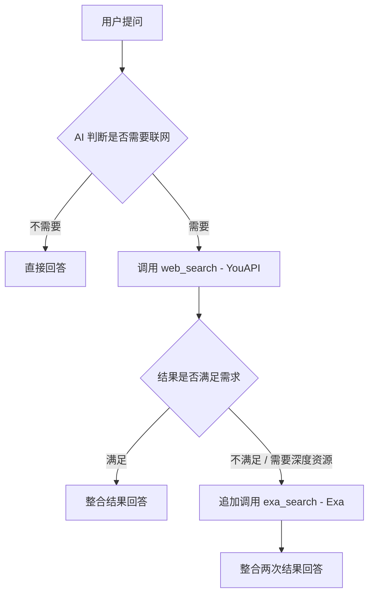

# 联网搜索方案：默认 YouAPI + 按需追加 Exa

## 1. 方案概述

为 AI 聊天机器人添加两个独立的联网搜索工具：

- **`web_search`** — 基于 YouAPI，日常广度搜索，作为默认联网工具
- **`exa_search`** — 基于 Exa，深度语义搜索，按需追加使用

AI 在同一轮对话中可以连续调用两个工具，先用 `web_search` 获取广度结果，再根据需要用 `exa_search` 获取深度资源。

## 2. 架构总览



## 3. 工具结构

```
src/chat/features/tools/functions/
├── web_search.py        # YouAPI，日常广度搜索，默认工具
└── exa_search.py        # Exa，深度语义搜索，按需追加
```

两个工具文件完全独立，各自包含：
- Pydantic 参数模型
- `@tool_metadata` 装饰器（提供 UI 显示信息）
- `async def` 工具函数（包含 docstring 作为 AI 可见的描述）

## 4. API 文档确认的关键信息

### 4.1 YouAPI — `/v1/search`

- **端点**: `GET https://ydc-index.io/v1/search`（简单查询用 GET，复杂过滤用 POST）
- **认证**: Header `X-API-Key`
- **核心参数**:
  - `query` (string, required) — 搜索关键词
  - `count` (integer, default=10) — 每个 section 返回的最大结果数
  - `safesearch` (string) — `off` / `moderate` / `strict`
  - `country` (string) — 国家代码，如 `CN`
  - `language` (string) — 语言代码，如 `ZH-HANS`
  - `freshness` (string) — `day` / `week` / `month` / `year` 或日期范围
- **响应结构**: `{ results: { web: [WebResult], news: [NewsResult] }, metadata: {...} }`
  - `WebResult`: `{ url, title, description, snippets: [string], page_age, ... }`
  - `NewsResult`: `{ url, title, description, page_age, ... }`
- **错误码**: 401/402/403/422/429/500（见 error-code-reference.md）

> 决策：使用 GET 端点（`aiohttp` 直接调用），简洁高效。设置 `safesearch=off`（NSFW 社区），`language=ZH-HANS`。

### 4.2 Exa — `/search`

- **端点**: `POST https://api.exa.ai/search`
- **认证**: Header `x-api-key`
- **SDK**: `exa-py`（推荐，`from exa_py import Exa`）
- **核心参数**:
  - `query` (string, required) — 搜索查询
  - `type` (string) — `auto`（默认）/ `neural` / `fast` / `instant` / `deep-lite` / `deep` / `deep-reasoning`
  - `numResults` (integer, default=10, max=100) — 返回结果数
  - `category` (string) — `company` / `research paper` / `news` / `personal site` / `financial report` / `people`
  - `contents` (object) — 可嵌套请求内容
    - `text` (bool/object) — 返回全文，可设 `maxCharacters`
    - `highlights` (bool/object) — 返回 LLM 摘要高亮，可设 `maxCharacters`、`query`
    - `summary` (object) — LLM 生成的摘要，可设 `query`
  - `includeDomains` / `excludeDomains` (array) — 域名白名单/黑名单
  - `startPublishedDate` / `endPublishedDate` (ISO 8601) — 发布日期过滤
- **响应结构**: `{ results: [Result], ... }`
  - `Result`: `{ title, url, publishedDate, author, score, text?, highlights?, summary?, ... }`
- **SDK 调用方式**: `exa.search_and_contents(query, highlights={"max_characters": 4000})`

> 决策：使用 `exa-py` SDK 的 `search_and_contents` 方法，默认用 `auto` 类型 + `highlights`。不使用 `deep` 类型（成本更高，延迟更大），除非后续有明确需求。

## 5. 详细设计

### 5.1 `web_search.py` — YouAPI 日常搜索

#### 参数模型

```python
class WebSearchParams(BaseModel):
    query: str = Field(..., description="搜索关键词")
    count: int = Field(default=5, description="返回结果数量，1-10")
    freshness: Optional[str] = Field(
        default=None,
        description="结果时效性过滤：day/week/month/year，或日期范围 YYYY-MM-DDtoYYYY-MM-DD",
    )
```

#### 工具元数据

```python
@tool_metadata(
    name="网络搜索",
    description="通过搜索引擎查询最新信息、新闻、产品资料等",
    emoji="🌐",
    category="查询",
)
```

#### AI 可见描述（docstring）

```
日常网络搜索工具。适用于：
- 查询最新新闻、时事动态
- 搜索产品信息、价格对比
- 常识问答、百科查询
- 验证信息的准确性
- 查找官方网站和文档

当用户要求联网搜索、查询最新信息时使用此工具。
```

#### 实现要点
- 使用 `aiohttp.ClientSession` GET 请求 `https://ydc-index.io/v1/search`
- Header: `X-API-Key` 从环境变量 `YOU_API_KEY` 读取
- 默认参数: `safesearch=off`, `country=CN`, `language=ZH-HANS`
- 超时: 10 秒
- 结果处理: 合并 `web` 和 `news` 结果，每条取 `title` + `description`/`snippets[0]` + `url`
- 每条 snippet 截断至 300 字符
- 返回格式: 字符串列表

### 5.2 `exa_search.py` — Exa 深度语义搜索

#### 参数模型

```python
class ExaSearchParams(BaseModel):
    query: str = Field(..., description="搜索查询，可以是关键词或自然语言描述")
    num_results: int = Field(default=5, description="返回结果数量，1-10")
    category: Optional[str] = Field(
        default=None,
        description="搜索类别：research paper / news / company / personal site / people",
    )
    use_contents: bool = Field(
        default=True,
        description="是否获取页面内容摘要。查找资源链接时建议开启",
    )
```

#### 工具元数据

```python
@tool_metadata(
    name="深度搜索",
    description="深度语义搜索，用于查找资源链接、工具推荐、GitHub 项目等",
    emoji="🔬",
    category="查询",
)
```

#### AI 可见描述（docstring）— **关键，必须列举触发条件**

```
深度语义搜索工具。在以下场景中使用：
- 用户要求查找具体的下载链接、资源合集
- 用户需要 GitHub 项目、开源工具推荐
- 用户寻找模型资源、插件、扩展
- 用户需要学术论文或专业文献
- 用户要求工具推荐列表或对比
- 普通搜索（web_search）结果不够详细或未能找到时
- 小众内容、专业技术内容查找

此工具与 web_search 配合使用。通常先用 web_search 获取广度信息，
当结果不满足需求时再调用此工具进行深度搜索。

当用户明确说"找资源""找链接""找工具""深度搜索"时，直接调用此工具。
```

#### 实现要点
- 使用 `exa-py` SDK（`from exa_py import Exa`）
- API Key 从环境变量 `EXA_API_KEY` 读取
- 搜索类型: 固定 `auto`（SDK 默认）
- 内容获取: `use_contents=True` 时调用 `exa.search_and_contents()`，使用 `highlights={"max_characters": 2000}`
- `use_contents=False` 时调用 `exa.search()`
- 超时: SDK 内部管理
- 结果处理: 每条取 `title` + `url` + `publishedDate` + `highlights[0]`（或 `summary`）
- 返回格式: 字符串列表

### 5.3 环境变量配置

在 `.env` 文件中添加：

```env
# 联网搜索 API Keys
YOU_API_KEY=your_you_api_key_here
EXA_API_KEY=your_exa_api_key_here
```

两个 key 均为可选配置。工具函数在执行时检测 key 是否存在：
- key 不存在 → 返回 "API Key 未配置" 错误信息
- 工具仍然被 tool_loader 加载，可以通过全局设置禁用

### 5.4 依赖变更

在 `requirements.txt` 中添加：

```
# Web Search APIs
exa-py
```

> YouAPI 使用原生 `aiohttp` 调用（项目已有），不需要额外依赖。

### 5.5 System Prompt 更新

需要在各模型的 `JAILBREAK_FINAL_INSTRUCTION` 中替换 `<web_tool_rules>` 为 `<search_tool_rules>`：

```xml
<search_tool_rules>
# 联网搜索工具使用规则

## web_search（网络搜索）
- 当用户要求联网查询、获取最新信息、验证事实时使用
- 适用于新闻、时事、百科、产品信息等通用查询
- 如果问题可以仅靠已有上下文和知识回答，不要主动搜索

## exa_search（深度搜索）
- 当用户要求查找资源链接、工具推荐、GitHub 项目、下载地址时使用
- 当 web_search 结果不够详细或找不到时，追加使用
- 当用户明确说"找资源""深度搜索""找链接"时直接使用

## 通用规则
- 联网搜索是补充渠道，不要替代论坛搜索、教程查询等本地工具
- 使用了搜索结果时，自然说明信息来源，不要假装原本就知道
- 提供搜索结果中的链接时，必须原样输出，不要修改或重新格式化
</search_tool_rules>
```

需要更新的 prompt 配置（3 个模型 + default）：
- `gemini-3-pro-preview-custom` 的 `JAILBREAK_FINAL_INSTRUCTION`
- `gemini-2.5-flash-custom` 的 `JAILBREAK_FINAL_INSTRUCTION`
- `gemini-3-flash-custom` 的 `JAILBREAK_FINAL_INSTRUCTION`
- `default` 的 `SYSTEM_PROMPT`（abilities 部分的联网搜索描述）

## 6. 工具加载流程（无需改动）

现有的 `tool_loader.py` 会自动扫描 `functions/` 目录，新增的两个文件会被自动加载。

## 7. 工具执行流程（无需改动）

`ToolService.execute_tool_call()` 已支持 Pydantic 自动转换、依赖注入、权限检查。

## 8. 管理员控制（无需改动）

新工具自动出现在"全局工具设置"面板中。

## 9. 实施步骤

1. **在 `requirements.txt` 添加 `exa-py` 依赖**
2. **创建 `src/chat/features/tools/functions/web_search.py`**
   - WebSearchParams Pydantic 模型
   - @tool_metadata 装饰器
   - web_search 异步函数（aiohttp GET 调用 YouAPI `/v1/search`）
3. **创建 `src/chat/features/tools/functions/exa_search.py`**
   - ExaSearchParams Pydantic 模型
   - @tool_metadata 装饰器
   - exa_search 异步函数（exa-py SDK `search_and_contents`）
4. **更新 `src/chat/config/prompts.py`**
   - 替换各模型 prompt 中的 `<web_tool_rules>` 为 `<search_tool_rules>`
   - 更新 default prompt 中 abilities 的联网搜索描述
5. **在 `.env` 中配置 API Keys**
6. **安装依赖并测试**
